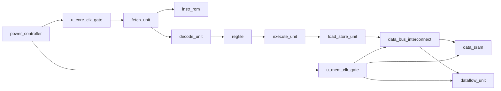

# Architecture Notes

The RTL is a small single-issue CPU model intended for power intent exploration,
not benchmark performance. Its main purpose is to provide realistic hierarchy for
UPF experiments.

## RTL Instances

These top-level instance names are used by the power-scheme JSON files:

- `u_power_controller`
- `u_core_clk_gate`
- `u_mem_clk_gate`
- `u_fetch`
- `u_icache`
- `u_decode`
- `u_regfile`
- `u_execute`
- `u_lsu`
- `u_dbus`
- `u_dmem`
- `u_dataflow`

## Load/Store Bus

The first version of this CPU connected `execute_unit` directly to
`data_sram` or the dataflow MMIO registers. That made every load/store look like
a one-cycle operation and gave the CPU no way to observe wait states,
backpressure, or a response phase.

The current RTL has a tiny data-side request/response bus:

| Signal | Meaning |
| --- | --- |
| `bus_req_valid` / `bus_req_ready` | One request handshake from the CPU-side LSU. |
| `bus_req_we` | Write when high, read when low. |
| `bus_req_addr` / `bus_req_wdata` | Request address and write data. |
| `bus_req_byte_en` | Byte lane mask, currently always `4'hf`. |
| `bus_resp_valid` | Response handshake back to the LSU. |
| `bus_resp_rdata` | Read data for loads and MMIO reads. |
| `bus_resp_error` | Error response for unmapped addresses. |

`u_lsu` is intentionally single-outstanding. When `execute_unit` issues a load
or store, `u_lsu` launches one bus request, stalls fetch/decode by holding the
PC, waits for a response, and then releases the stall for one retire cycle. Load
instructions write back only in that response/retire cycle. Store instructions
also retire after the response, which keeps the model simple and precise.

`u_dbus` is the tiny interconnect. It routes low SRAM addresses to `u_dmem`,
routes offsets `4` through `7` to `u_dataflow`, and returns an error response for
unmapped addresses. This is still much smaller than AXI, CHI, TileLink, or an
industrial coherent fabric, but it introduces the commercial CPU/SoC concept
that memory and MMIO have latency and backpressure instead of being direct
combinational wires.

## Dataflow Unit

`u_dataflow` is a small memory-mapped multiply-accumulate unit used to explore
CPU versus dataflow offload efficiency. In this toy CPU it is still an MMIO
slave peripheral: the CPU reaches it through the ordinary load/store path, it
does not fetch operands from memory by itself, and it shares the existing CPU
power-domain behavior while being clocked through the memory-side clock gate.
The control interface now sits behind `u_dbus`, so reads and writes complete
through the same response phase as SRAM accesses.

The toy MMIO map uses byte offsets that fit the existing 4-bit immediate load
and store format:

| Offset | Access | Meaning |
| ---: | --- | --- |
| `4` | write/read | operand A |
| `5` | write/read | operand B |
| `6` | write/read | command/status |
| `7` | read/write | accumulated result on reads, repeat count on writes |

Command bit `0` starts MAC work. Command bit `1` clears the accumulator. A
command value of `3` clears first and then starts from zero in the same MMIO
access. Command writes are treated as pulses rather than sticky state, so
holding the same command value does not repeatedly launch new operations.

Status reads from offset `6` expose:

| Bit(s) | Meaning |
| ---: | --- |
| `0` | done |
| `1` | busy |
| `2` | repeat count is greater than one |
| `3` | one-cycle MAC-valid pulse |
| `15:8` | remaining repeat count |
| `23:16` | programmed repeat count |

The write side of offset `7` adds a small local repeat-count mode. Software can
write operands once, write a repeat count, and then issue one start command; the
dataflow block performs that many MAC cycles internally using the local operand
registers. This is still intentionally tiny, but it avoids the pure
"one CPU store per MAC" structure for simple repeated operations.

Commercial high-performance accelerators usually go further: the CPU writes
descriptors and status through MMIO, while the accelerator datapath acts as a
data-side bus master or coherent requester to fetch operand streams, perform
many operations locally, and write results back. This CPU does not yet have a
load/store queue, cache-coherent port, DMA engine, interrupt path, or memory
protection model, so the current RTL does not pretend to implement that
behavior. The new bus/interconnect foundation is the place where a future
dataflow requester, descriptor mode, scratchpad mode, or DMA-like path can be
added cleanly.

## Power Intent Concepts Covered

- Single-domain always-on operation.
- Clock gating through RTL clock-enable control.
- Switched power domains.
- Isolation on switched-domain outputs.
- Retention for architectural state.
- Multiple supply states for DVFS.
- Level shifters between domains that can operate at different voltages.
