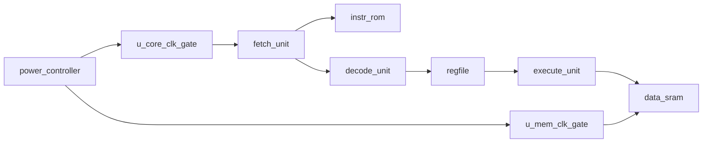

# Architecture Notes

The RTL is a small single-issue CPU model intended for power intent exploration,
not benchmark performance. Its main purpose is to provide realistic hierarchy for
UPF experiments.

## RTL Instances

These top-level instance names are used by the power-scheme JSON files:

- `u_power_controller`
- `u_core_clk_gate`
- `u_mem_clk_gate`
- `u_fetch`
- `u_icache`
- `u_decode`
- `u_regfile`
- `u_execute`
- `u_dmem`

## Power Intent Concepts Covered

- Single-domain always-on operation.
- Clock gating through RTL clock-enable control.
- Switched power domains.
- Isolation on switched-domain outputs.
- Retention for architectural state.
- Multiple supply states for DVFS.
- Level shifters between domains that can operate at different voltages.

