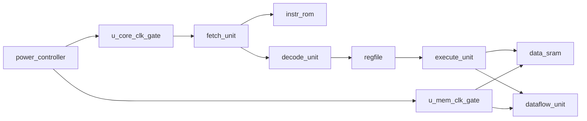

# Architecture Notes

The RTL is a small single-issue CPU model intended for power intent exploration,
not benchmark performance. Its main purpose is to provide realistic hierarchy for
UPF experiments.

## RTL Instances

These top-level instance names are used by the power-scheme JSON files:

- `u_power_controller`
- `u_core_clk_gate`
- `u_mem_clk_gate`
- `u_fetch`
- `u_icache`
- `u_decode`
- `u_regfile`
- `u_execute`
- `u_dmem`
- `u_dataflow`

## Dataflow Unit

`u_dataflow` is a small memory-mapped multiply-accumulate unit used to explore
CPU versus dataflow offload efficiency. It shares the existing CPU power domain
in this first model and is clocked through the memory-side clock gate because
the CPU reaches it through the load/store path.

The toy MMIO map uses byte offsets that fit the existing 4-bit immediate load
and store format:

| Offset | Access | Meaning |
| ---: | --- | --- |
| `4` | write/read | operand A |
| `5` | write/read | operand B |
| `6` | write/read | command/status |
| `7` | read | accumulated result |

Command bit `0` starts one MAC operation. Command bit `1` clears the
accumulator. A command value of `3` clears and starts from zero in one access.

## Power Intent Concepts Covered

- Single-domain always-on operation.
- Clock gating through RTL clock-enable control.
- Switched power domains.
- Isolation on switched-domain outputs.
- Retention for architectural state.
- Multiple supply states for DVFS.
- Level shifters between domains that can operate at different voltages.
