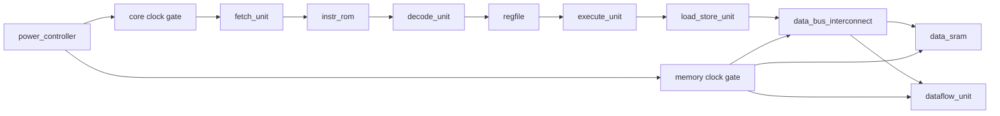

# Mobile CPU Visual Walkthrough

This guide explains the toy mobile CPU, the workload flow, and the low-power
tradeoffs that appear in the generated reports. It complements the generated
HTML dashboard from:

```sh
make visual-story
```

The generated dashboard is written to `reports/visual_story/index.html`. It is a
derived artifact, so it is not checked into Git. The page now starts with RTL
check-in methodology sections before the animation:

- check-in summary,
- metric deltas versus baseline,
- hierarchy attribution,
- designer optimization cards,
- missing data and instrumentation requests.

## CPU Datapath

The CPU is intentionally small so that power behavior is easy to inspect:



The front end fetches a 16-bit instruction from `instr_rom`, the decode unit
splits out opcode and register fields, the register file supplies operands, and
the execute unit either performs an ALU operation or issues a load/store. Loads
and stores go through a tiny single-outstanding `load_store_unit` and
`data_bus_interconnect`, so the PC can stall while SRAM or MMIO returns a
response. Normal loads and stores access `data_sram`. Stores and loads to
offsets `4`, `5`, `6`, and `7` access the memory-mapped `dataflow_unit`.

The `dataflow_unit` is a tiny multiply-accumulate block. It is still controlled
as an MMIO slave, but it now has a small local repeat-count mode so software can
program operands/control once and let the block perform several MAC cycles
internally. It exists to make CPU versus offload tradeoffs visible:

- CPU-only MAC workloads spend more instructions in the ALU.
- Dataflow MAC workloads spend instructions on MMIO control traffic and can
  amortize that traffic when repeat mode is used.
- The power model can then compare useful operation count, memory intensity,
  dataflow MAC count, and recovery energy.

## Workload To Power Flow

The project supports hand-written assembly and generated workload intent specs:

```text
workload_specs/*.json or workloads/*.s
  -> assembly
  -> build/workloads/*.memh
  -> Verilator simulation
  -> VCD or FST waveform
  -> IEEE 2416 activity extraction
  -> block/domain power estimate
  -> workload profile
  -> visual dashboard
```

The workload describes software-visible behavior. The scenario Tcl file drives
platform power-management requests such as sleep, deep sleep, wake, and
performance boost. This separation lets the same program run under different
power schemes.

## Power Concepts In The Visuals

The dashboard uses the same domains and states as the UPF/2416 flow:

| Concept | What To Look For |
| --- | --- |
| `PD_AON` | Always-on controller energy and mode transitions. |
| `PD_CPU` | Fetch, decode, register file, execute, instruction ROM, and dataflow energy. |
| `PD_MEM` | Data SRAM energy. |
| Clock gating | Lower clock activity in idle or light sleep. |
| Power gating | CPU and memory domains off in deep sleep. |
| Isolation | Switched-domain outputs protected when a domain is off. |
| Retention | Architectural state saved/restored around sleep states. |
| DVFS | Voltage/frequency level changes reflected in state and power timelines. |

## Reading The Tradeoffs

Use the generated workload cards and charts together:

- Total energy shows the cost of the full run, including recovery.
- Energy per useful instruction reduces the effect of NOPs and idle padding.
- Memory intensity shows how much of the workload drives load/store behavior.
- Dataflow MAC count shows how much useful work moved into the accelerator.
- Recovery energy shows how much energy is spent leaving low-power states.
- Domain energy reveals whether a workload is CPU-dominated, memory-dominated,
  or always-on-controller dominated.

For example, a dataflow-heavy workload may reduce ALU work but increase
memory-mapped control traffic. Whether that is a win depends on how many useful
MAC operations are done per MMIO sequence, whether repeat mode is used, and how
much low-power recovery energy is included in the scenario.

## RTL Check-In Metrics

The check-in flow writes machine-readable metrics to:

```text
reports/power_metrics.json
```

The metrics are grouped by workload, domain, block, event, and RTL hierarchy.
They include energy, average power, cycles, retired/useful instructions,
dataflow MACs, pJ/MAC, memory intensity, WFI density, LSU stalls, MMIO/SRAM
transactions, front-end stall activity, dataflow utilization, and clock-enable
efficiency where available.

When a baseline exists, the flow also writes:

```text
reports/power_metrics_delta.json
reports/checkin_summary.md
```

Review these before reading optimization cards. Red/yellow deltas identify what
changed; hierarchy attribution tells you where to inspect RTL; cards explain why
the behavior may be wasteful and what RTL change to consider.

## Designer Optimization Cards

The visual story also emits an actionable low-power review artifact:

```text
reports/power_optimization_cards.json
```

Each card is generated from the workload profile and IEEE 2416 activity counts.
The card names the wasting mechanism, RTL hierarchy, evidence, suggested design
change, expected benefit, risk, verification plan, before metrics, and target
after metrics. The first card set looks for:

- dataflow MMIO/control traffic that is too high per useful MAC,
- LSU stall cycles that keep the CPU waiting on memory or MMIO,
- front-end valid work held during load/store stalls,
- low dataflow MAC utilization while the dataflow block is clocked,
- domain-energy evidence that says whether a new dataflow power domain is
  premature.

Treat these as logic-design review prompts. A card is not a signoff result; it
is a traceable reason to make a small RTL change, then rerun the same workload
and compare the `before_metrics` and `after_metrics` fields.

Cards are hierarchy-aware through `power_hierarchy_map.json`. Each card tries to
name the architectural block, RTL hierarchy, related upstream/downstream
hierarchy, likely control signal or FSM, suggested fix pattern, and verification
tests. If a future event cannot be mapped, the metrics file reports the missing
mapping explicitly.

## Commands

Generate the default visual story data and dashboard:

```sh
make visual-story
```

Capture a check-in baseline:

```sh
make power-baseline TECH=generic_7nm SCHEME=clock_gated_idle
```

Run an RTL check-in comparison:

```sh
make power-check TECH=generic_7nm SCHEME=clock_gated_idle
```

Run CI-style advisory gating that fails only on red regressions:

```sh
make power-check-ci TECH=generic_7nm SCHEME=clock_gated_idle
```

Open it locally on macOS:

```sh
make open-visual-story
```

The default dashboard compares:

- `cpu_mac`
- `dataflow_mac`
- `generated/dataflow_energy_probe`
- `generated/sleep_wake_probe`

You can override the technology or scheme:

```sh
make visual-story TECH=generic_7nm SCHEME=clock_gated_idle
```

The checked-in source of truth is the documentation, workload specs, and
generator tool. The generated report directory is intentionally ignored by Git.
